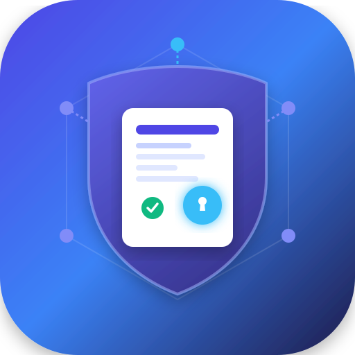

<div align="center">



# Fabric CA Console

[](LICENSE)
[](https://go.dev/)
[](https://nextjs.org/)
[](https://docs.docker.com/compose/)

</div>

Fabric CA Console is an open-source web console and API gateway for managing identities and certificates issued by [Hyperledger Fabric CA](https://hyperledger-fabric-ca.readthedocs.io/).

It provides a browser-based workflow for registering identities, enrolling certificates, creating Fabric MSP directories, renewing credentials, revoking certificates, inspecting certificates, and tracking generated CRLs. The Go backend handles the cryptographic work and signs administrative requests to Fabric CA; the Next.js frontend provides the operational interface.

> This project is intended for development, test networks, and deployments where the operator can securely manage registrar credentials. Review the security guidance before exposing it outside a trusted network.

## Features

- CA status and issuer information through the dashboard and `/api/v1/cainfo`.
- Identity registration with type, affiliation, and Fabric CA attributes.
- Enrollment for `client`, `user`, `admin`, `peer`, and `orderer` identities.
- Automatic private-key, signing-certificate, CA-chain, TLS CA, and NodeOU MSP files.
- Custom CSR subject fields and DNS/IP SANs during enrollment.
- Re-enrollment using an existing identity, with optional CSR replacement.
- Identity and certificate revocation with CRL persistence.
- Certificate listing, filtering, decoding, expiry inspection, and revocation status.
- Docker Compose deployment for the frontend and backend.
- Postman examples for exercising the backend directly.

## Architecture

```text
Browser
  |
  v
Next.js frontend
  |
  v
Go/Fiber API  ---- TLS ---->  Hyperledger Fabric CA
  |
  +---- registrar certificate and private key
  +---- generated MSP and CRL files
```

The backend is a proxy rather than a replacement for Fabric CA. It authenticates administrative operations with a registrar certificate and ECDSA private key, performs enrollment and re-enrollment operations, and writes the returned artifacts into Fabric-compatible directories.

## Requirements

For the Docker workflow:

- Docker Engine 20.10 or newer
- Docker Compose v2
- GNU Make (optional)
- A running Hyperledger Fabric CA
- A Docker network that can reach the Fabric CA container

For local development:

- Go 1.23 or newer
- Node.js compatible with Next.js 16
- npm
- A reachable Fabric CA and its TLS root certificate

The bundled `test-network` is useful for development and demonstration. It is not required when connecting to an existing Fabric network.

## Quick Start With the Test Network

To set up and start the complete environment in a single command, run from the repository root:

```bash
make all
```

This single command automatically executes all necessary setup steps: starting the Fabric test network with CA, deploying sample chaincode, copying registrar crypto credentials, and starting the Docker containers.

Once running, access the application:
- **Frontend UI:** [http://localhost:3001](http://localhost:3001)
- **Backend API:** [http://localhost:3000](http://localhost:3000)

The frontend container uses `FABRIC_CA_API_URL=http://backend:3000` to reach the backend over the Compose network. The browser normally calls the frontend-relative `/api/v1/...` routes.

## Documentation

- [Specifications and operations](docs/SPECIFICATIONS.MD): environment variables, MSP output, API endpoints, local development, troubleshooting, and security guidance.
- [Connect to a custom Fabric network](docs/customnetwork.md): configure the console for your own Fabric CA and Docker network.


## Contributing

Contributions are welcome! If you are open to contributing, there are open issues available.

Guidelines for contributing:
1. First, create an issue to explain the problem or feature request before starting work.
2. Once the issue is discussed, create a pull request with focused changes that preserve compatibility with existing API request fields.
3. Update documentation when behavior changes.

## Video Overview

Check out a video walkthrough showcasing the features and interface of the **Fabric CA Console**:

[Watch the Fabric CA Console walkthrough on YouTube](https://youtu.be/LjaI43G0UhM)

## License

Fabric CA Console is released under the [Apache License 2.0](LICENSE).

